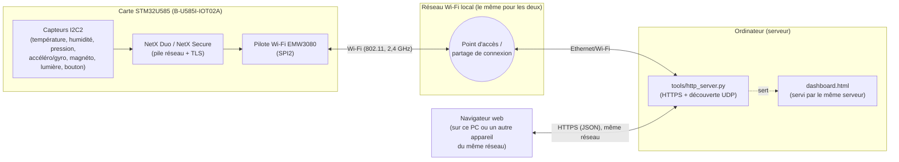
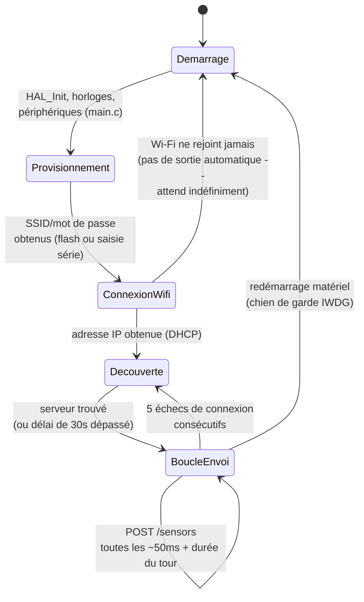
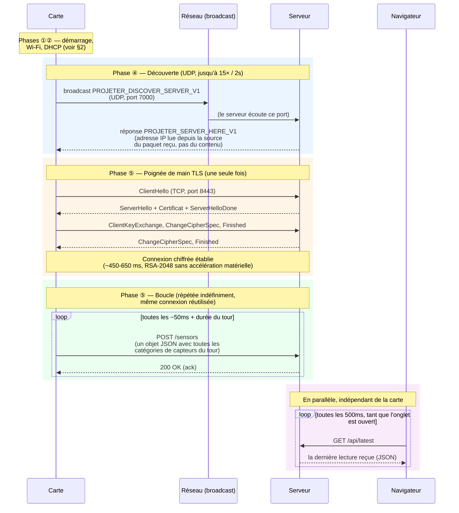

# Architecture et communication carte ↔ serveur

Ce document illustre, avec des diagrammes, comment la carte STM32 et le
serveur (`tools/http_server.py`) communiquent, et les différentes phases
que la carte traverse entre son démarrage et son fonctionnement normal en
continu. Pour le détail du code, voir `Doc/ARCHITECTURE.md` (carte) et
`tools/README.md` (serveur).

## 1. Vue d'ensemble — qui parle à qui

Deux échanges bien distincts, tous deux passant par le même serveur :

- **Carte ↔ Serveur** : UDP (découverte) puis HTTPS (envoi des lectures) —
  décrit en détail dans les sections suivantes.
- **Navigateur ↔ Serveur** : HTTPS classique, indépendant de la carte —
  le navigateur interroge simplement l'état le plus récent que le serveur a
  reçu de la carte (`GET /api/latest`, toutes les 500 ms).

## 2. Les phases de vie de la carte

### Détail de chaque phase

**① Démarrage matériel** (`Core/Src/main.c`) — `HAL_Init()`, configuration
de l'horloge système, puis initialisation des périphériques (GPIO, cache
d'instructions, SPI2 pour le module Wi-Fi, USART1 pour le port série de
debug, générateur de nombres aléatoires matériel). Se termine par
`MX_ThreadX_Init()`, qui démarre le système d'exploitation temps réel
(ThreadX) — le programme ne revient jamais dans `main()` après ça.

**② Provisionnement Wi-Fi** (`Core/Src/wifi_provisioning.c`,
`WifiProvisioning_Init()`) — avant même de tenter de rejoindre un réseau,
la carte décide quel SSID/mot de passe utiliser : soit un réseau déjà
enregistré en mémoire flash (cas normal, aucune action requise), soit une
saisie au clavier via le port série si aucun réseau n'est enregistré ou si
le bouton USER est maintenu au démarrage. Voir `Doc/INSTALLATION.md` §5
pour le déroulé pratique de cette étape.

**③ Connexion Wi-Fi + DHCP** (`App_Main_Thread_Entry`,
`NetXDuo/App/app_netxduo.c`) — le pilote Wi-Fi rejoint le réseau avec les
identifiants obtenus à l'étape précédente, puis un client DHCP demande une
adresse IP. Cette phase n'a pas de limite de temps : si le Wi-Fi ne
rejoint jamais (mauvais mot de passe, réseau hors de portée, réseau en
5 GHz non supporté), la carte affiche un message toutes les 5 secondes
mais reste bloquée ici indéfiniment plutôt que d'abandonner silencieusement.

**④ Découverte du serveur** (`Discover_ServerIP()`, même fichier) — la
carte diffuse une requête UDP en broadcast sur le réseau local (jusqu'à
**15 tentatives, espacées de 2 secondes**, soit ~30 secondes au total) et
attend qu'un serveur y réponde. Voir la section 3 ci-dessous pour le détail
de cet échange. Si personne ne répond dans ce délai, la carte continue
quand même avec une adresse de secours codée en dur
(`HTTP_SERVER_ADDRESS`), au cas où elle correspondrait par chance.

**⑤ Boucle d'envoi** (`App_HTTP_Thread_Entry`, boucle principale) — à
partir d'ici, la carte tourne indéfiniment : elle lit tous les capteurs,
envoie le résultat en HTTPS, attend l'accusé de réception, patiente ~50 ms,
et recommence. La connexion TCP+TLS est établie une seule fois puis
réutilisée pour tous les tours suivants (voir section 3) — c'est la phase
dans laquelle la carte passe l'essentiel de son temps de fonctionnement.

**Retour en arrière possible depuis la boucle d'envoi :**
- **5 échecs de connexion consécutifs** → la carte suppose que le serveur a
  changé d'adresse IP (par exemple, un partage de connexion redémarré en
  cours de route) et relance une découverte UDP (retour à la phase ④),
  sans redémarrer entièrement.
- **Un blocage de plus de 3-4 secondes** (un souci matériel ou réseau plus
  profond) → le chien de garde matériel (IWDG), indépendant du reste du
  programme, redémarre la carte complètement (retour à la phase ①). Voir
  `Doc/ARCHITECTURE.md` §4 et §8 pour le détail de ce mécanisme et des bugs
  qu'il a permis de découvrir.

## 3. Diagramme de séquence détaillé

Points importants illustrés ici :

- **La découverte (bleu) n'a lieu qu'une fois** au démarrage (ou après
  plusieurs échecs, voir §2) — pas à chaque tour.
- **La poignée de main TLS (orange) n'a lieu qu'une fois** elle aussi : la
  même connexion chiffrée sert à tous les tours suivants, justement pour
  éviter de repayer ~500-650 ms de calcul RSA à chaque lecture de capteur.
- **La boucle d'envoi (vert)** est ce qui tourne en continu pendant toute
  la durée de vie normale de la carte.
- **Le navigateur (violet) ne parle jamais directement à la carte** — il
  interroge uniquement le serveur, qui lui répète la dernière donnée reçue.
  La carte n'a même pas conscience qu'un navigateur existe.

## 4. Et si quelque chose se passe mal ?

| Situation | Ce qui se passe |
|---|---|
| Le serveur n'est pas encore démarré quand la carte cherche à le découvrir | Après ~30s sans réponse, la carte utilise l'adresse de secours codée en dur — si elle est fausse, la carte échoue simplement à se connecter (phase ⑤) jusqu'à ce que 5 échecs déclenchent une nouvelle découverte. |
| Le partage de connexion redémarre en cours de route (nouvelle adresse IP du serveur) | Après 5 échecs de connexion consécutifs, la carte relance une découverte UDP toute seule, sans intervention. |
| Le Wi-Fi est complètement hors de portée | La carte reste bloquée en phase ③ (connexion Wi-Fi), en réessayant, sans limite de temps. |
| Un blocage logiciel profond survient (bug de synchronisation, voir `Doc/ARCHITECTURE.md` §8) | Le chien de garde matériel (IWDG) redémarre la carte après 3-4 secondes d'absence de progrès — retour complet à la phase ①. |
| Le navigateur est fermé puis rouvert | Aucun impact sur la carte — le navigateur recommence simplement à interroger `/api/latest`, qui contient toujours la toute dernière lecture reçue. |
